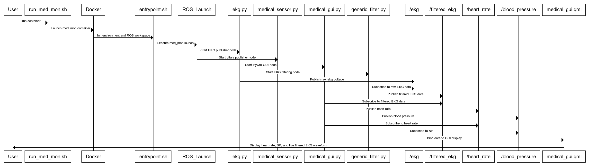
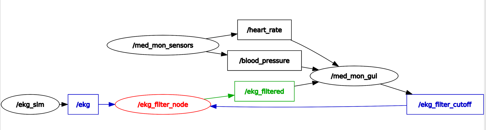

## Project Description

The Medical Monitoring (MedMon) project is a ROS-based system designed to simulate and visualize real-time medical sensor data. It includes components for simulating heart rate, blood pressure, and electrocardiogram (EKG) signals, as well as a filtering node for processing the EKG data. A Qt/QML-based graphical user interface (GUI) provides a user-friendly display of the sensor data and allows for interactive control of the EKG filter.

## Setup and Running the Project

### Prerequisites
- **Linux Users:**
  - Install Docker by following the [Docker Installation Guide for Ubuntu](https://docs.docker.com/engine/install/ubuntu/).

- **Windows and Mac Users:**
  - Configure a virtual machine using tools like UTM (Mac) or VirtualBox (Windows) to run a Linux system.

### System Configuration
The project has been tested on the following configuration:
- **Operating System:** Ubuntu 20.04 ([Download here](https://cdimage.ubuntu.com/releases/20.04/release/ubuntu-20.04.5-live-server-arm64.iso))
- **ROS Version:** Noetic
- **Python Version:** 3.8.10
- **Qt Version:** 5.12.8
- **Docker version:** 28.0.4

### Running the Project
1. **Build the Docker Image:**
   - Open a terminal and navigate to the root of the repository.
   - `chmod +x build_docker_image.sh`
   - Run the `build_docker_image.sh` script to build your Docker image.

2. **Start the Docker Container:**
   - `chmod +x run_med_mon.sh`
   - Use the `run_med_mon.sh` script located at the root of the repository to start a container using the built image.

## Architecture

The MedMon system follows a modular architecture with the following key components:

*   **Sensor Simulation Nodes:**
    *   `medical_sensor.py`: Simulates heart rate and blood pressure data.
    *   `ekg.py`: Simulates EKG data.
*   **Filter Node:**
    *   `generic_filter.py`: A generic filter node that is currently configured to apply a low-pass filter to the EKG signal. This node can be extended to support other filter types and be used with different signal sources by modifying its parameters.
*   **GUI Node:**
    *   `medical_gui.py`: Implements the Qt/QML-based GUI for visualizing sensor data and controlling the EKG filter.
*   **ROS Topics:**
    *   `/heart_rate`: Publishes heart rate data (Int32).
    *   `/blood_pressure`: Publishes blood pressure data (Float32).
    *   `/ekg`: Publishes raw EKG data (Float32).
    *   `/ekg_filtered`: Publishes filtered EKG data (Float32).
    *   `/ekg_filter_cutoff`: Controls the cutoff frequency of the EKG filter (Float32).
*   **Launch File:**
    *   `med_mon.launch`: Defines the ROS nodes and parameters to launch for the MedMon system.

## Basic Troubleshooting

*   **Docker container fails to start:**
    *   Check the Docker logs for any error messages.
    *   Ensure that the Docker image was built successfully.
    *   Verify that the Docker daemon is running.
*   **ROS nodes not communicating:**
    *   Verify that the ROS master is running.
    *   Check the ROS topic list to ensure that the nodes are publishing and subscribing to the correct topics.

## Advanced Troubleshooting

*   **Eg. GUI not displaying data , EKG filter not working**
    *   If you encounter issues at launch file. Check for error messages displayed in the console
    *   If the above console does not show error but you experience GUI not appearing/ data/ Filter not working issues, then you can do a deeper dive in a new terminal
    *   To do this:
        - Open new terminal
        - run `docker ps` to get the name of your container
        - execute `docker exec -it <container_name> /bin/bash`
        - check `rosnode list` , `rosnode info`
        - check `rostopic list` : echo the relevant topics to see if data as expected
        - execute `rqt_graph` to check if all nodes are communicating as expected
    *   If the above steps still dont resolve the issue
        - stop the container
        - enable `debug_logging` parameter in `med_mon.launch` file. This will enable additional debug messages
        - run `./run_med_mon.sh`
        - the logs are saved under `cat /root/.ros/log/latest/`
        - use `grep` here to filter out relevant messages from the logs
        - Eg usage. `cat /root/.ros/log/latest/med_mon_gui-4.log \| grep -i qml`
    *   Enable console.log messages in qml to verify GUI is emitting the data as expected and if the QML function is able to receive it.
    *   Check the ROS logs for any error messages related to the GUI node or the sensor data.
    *   Ensure that the Qt/QML dependencies are installed correctly in the Docker container.
*   **Virtual Machine running low on memory**
    *   Clean up unused docker containers
    *   `watch -n 1 free -h` : Monitor memory usage in real time (updated every second)
    *   `sudo journalctl --vacuum-time=3d` : Clean up system logs older than 3 days to free disk space.

